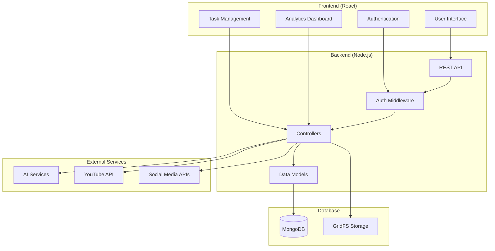
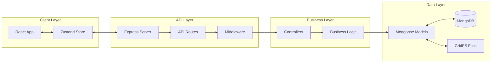
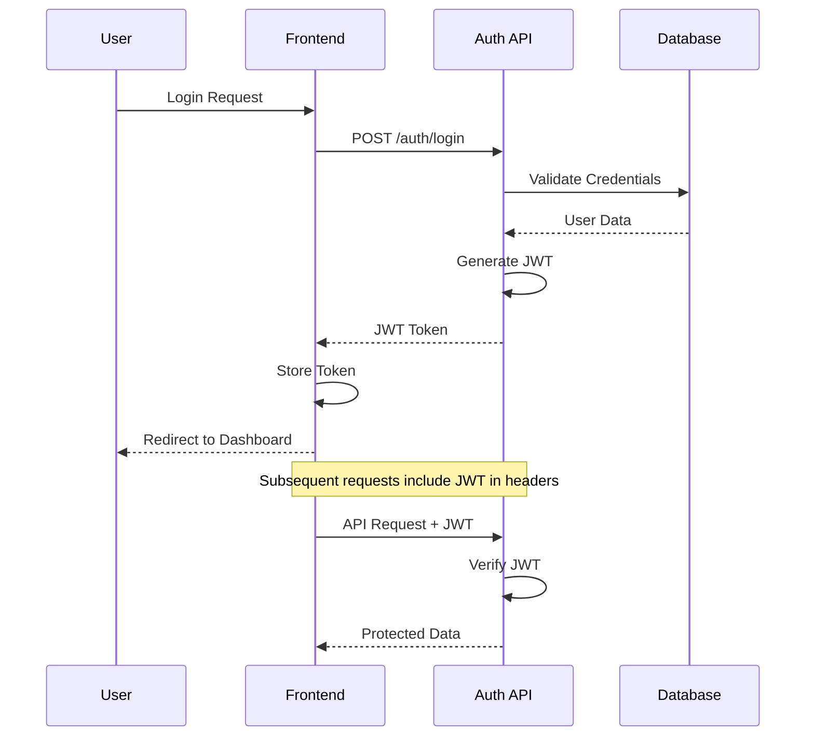
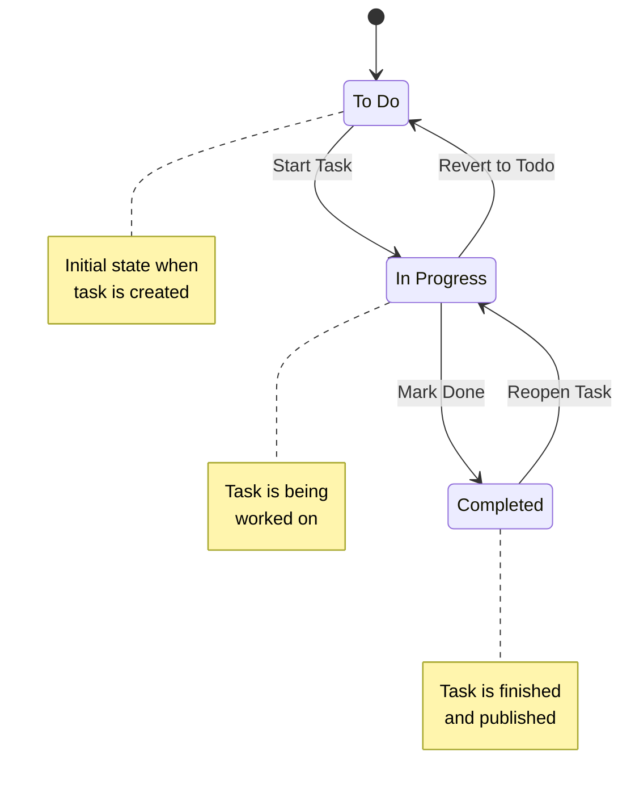
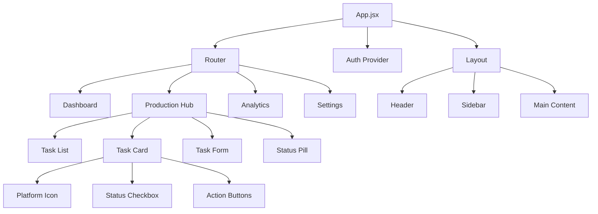
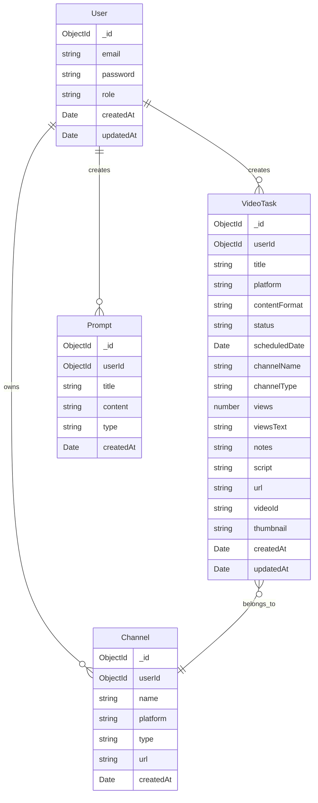

# System Architecture

## High-Level Architecture

```mermaid
graph TB
    subgraph "Frontend (React)"
        UI[User Interface]
        Auth[Authentication]
        Tasks[Task Management]
        Analytics[Analytics Dashboard]
    end
    
    subgraph "Backend (Node.js)"
        API[REST API]
        AuthM[Auth Middleware]
        Controllers[Controllers]
        Models[Data Models]
    end
    
    subgraph "External Services"
        AI[AI Services]
        YouTube[YouTube API]
        Social[Social Media APIs]
    end
    
    subgraph "Database"
        MongoDB[(MongoDB)]
        GridFS[GridFS Storage]
    end
    
    UI --> API
    Auth --> AuthM
    Tasks --> Controllers
    Analytics --> Controllers
    
    API --> AuthM
    AuthM --> Controllers
    Controllers --> Models
    Models --> MongoDB
    
    Controllers --> AI
    Controllers --> YouTube
    Controllers --> Social
    Controllers --> GridFS
```

## Data Flow Architecture

```mermaid
flowchart LR
    subgraph "Client Layer"
        React[React App]
        Store[Zustand Store]
    end
    
    subgraph "API Layer"
        Express[Express Server]
        Routes[API Routes]
        Middleware[Middleware]
    end
    
    subgraph "Business Layer"
        Controllers[Controllers]
        Services[Business Logic]
    end
    
    subgraph "Data Layer"
        Models[Mongoose Models]
        DB[(MongoDB)]
        Files[GridFS Files]
    end
    
    React <--> Store
    Store <--> Express
    Express --> Routes
    Routes --> Middleware
    Middleware --> Controllers
    Controllers --> Services
    Services --> Models
    Models <--> DB
    Models <--> Files
```

## Authentication Flow

```mermaid
sequenceDiagram
    participant U as User
    participant F as Frontend
    participant A as Auth API
    participant DB as Database
    
    U->>F: Login Request
    F->>A: POST /auth/login
    A->>DB: Validate Credentials
    DB-->>A: User Data
    A->>A: Generate JWT
    A-->>F: JWT Token
    F->>F: Store Token
    F-->>U: Redirect to Dashboard
    
    Note over F,A: Subsequent requests include JWT in headers
    
    F->>A: API Request + JWT
    A->>A: Verify JWT
    A-->>F: Protected Data
```

## Task Management Workflow

```mermaid
stateDiagram-v2
    [*] --> Todo
    Todo --> InProgress: Start Task
    InProgress --> Completed: Mark Done
    InProgress --> Todo: Revert to Todo
    Completed --> InProgress: Reopen Task
    
    Todo: To Do
    InProgress: In Progress
    Completed: Completed
    
    note right of Todo
        Initial state when
        task is created
    end note
    
    note right of InProgress
        Task is being
        worked on
    end note
    
    note right of Completed
        Task is finished
        and published
    end note
```

## Component Hierarchy

```mermaid
graph TD
    App[App.jsx]
    
    App --> Router[Router]
    App --> AuthProvider[Auth Provider]
    App --> Layout[Layout]
    
    Router --> Dashboard[Dashboard]
    Router --> ProductionHub[Production Hub]
    Router --> Analytics[Analytics]
    Router --> Settings[Settings]
    
    Layout --> Header[Header]
    Layout --> Sidebar[Sidebar]
    Layout --> Main[Main Content]
    
    ProductionHub --> TaskList[Task List]
    ProductionHub --> TaskCard[Task Card]
    ProductionHub --> TaskForm[Task Form]
    ProductionHub --> StatusPill[Status Pill]
    
    TaskCard --> PlatformIcon[Platform Icon]
    TaskCard --> StatusCheckbox[Status Checkbox]
    TaskCard --> ActionButtons[Action Buttons]
```

## Database Schema

```mermaid
erDiagram
    User {
        ObjectId _id
        string email
        string password
        string role
        Date createdAt
        Date updatedAt
    }
    
    VideoTask {
        ObjectId _id
        ObjectId userId
        string title
        string platform
        string contentFormat
        string status
        Date scheduledDate
        string channelName
        string channelType
        number views
        string viewsText
        string notes
        string script
        string url
        string videoId
        string thumbnail
        Date createdAt
        Date updatedAt
    }
    
    Channel {
        ObjectId _id
        ObjectId userId
        string name
        string platform
        string type
        string url
        Date createdAt
    }
    
    Prompt {
        ObjectId _id
        ObjectId userId
        string title
        string content
        string type
        Date createdAt
    }
    
    User ||--o{ VideoTask : creates
    User ||--o{ Channel : owns
    User ||--o{ Prompt : creates
    VideoTask }o--|| Channel : belongs_to
```