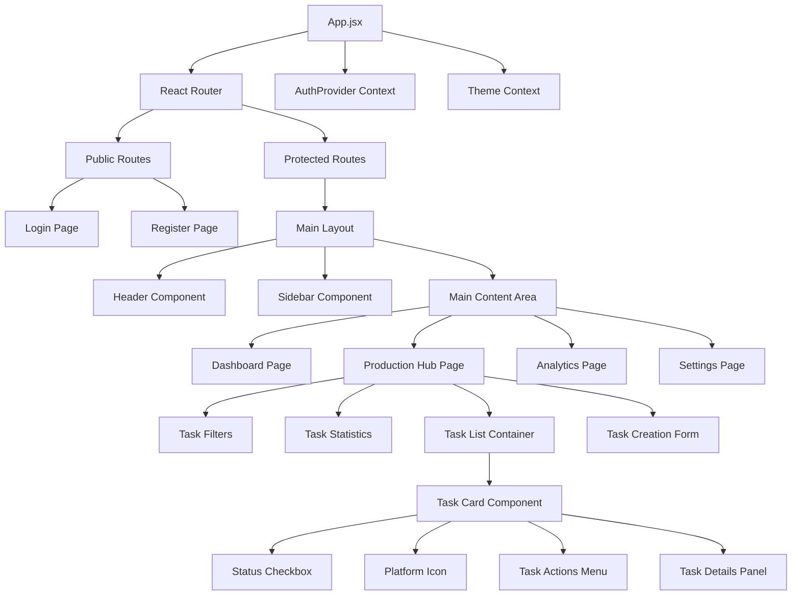
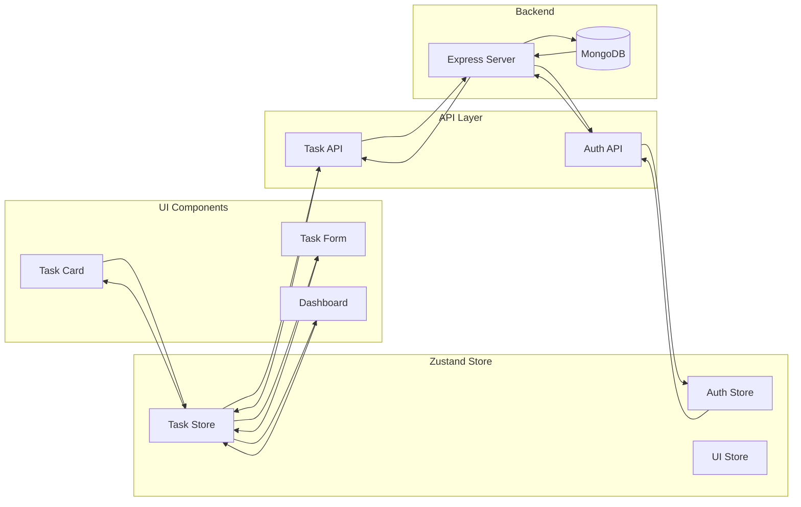
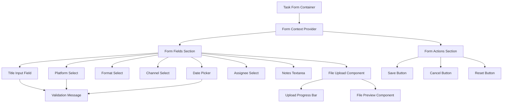
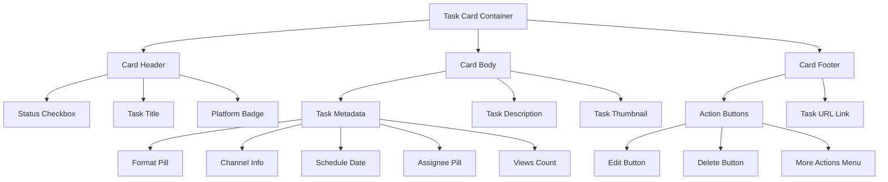
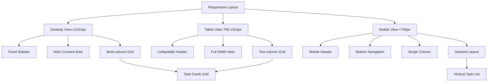
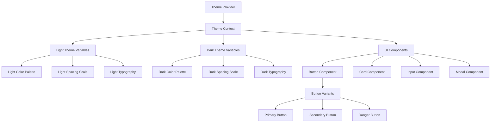
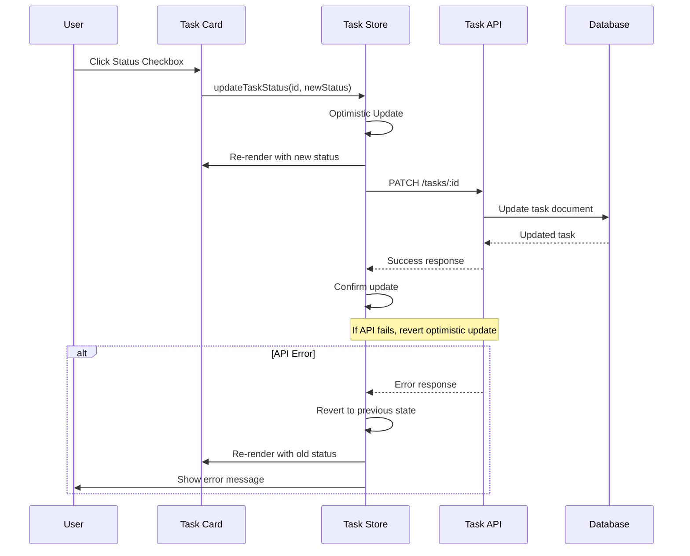

# UI Component Diagrams

## Component Hierarchy

## State Management Flow

## Form Component Structure

## Task Card Component Breakdown

## Responsive Layout Structure

## Theme System Architecture

## Data Flow in Task Management

