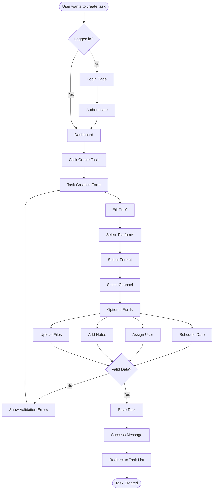
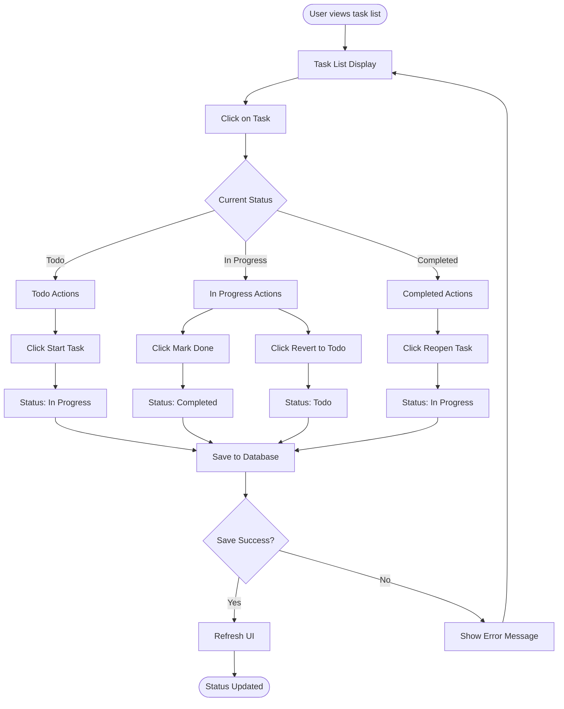
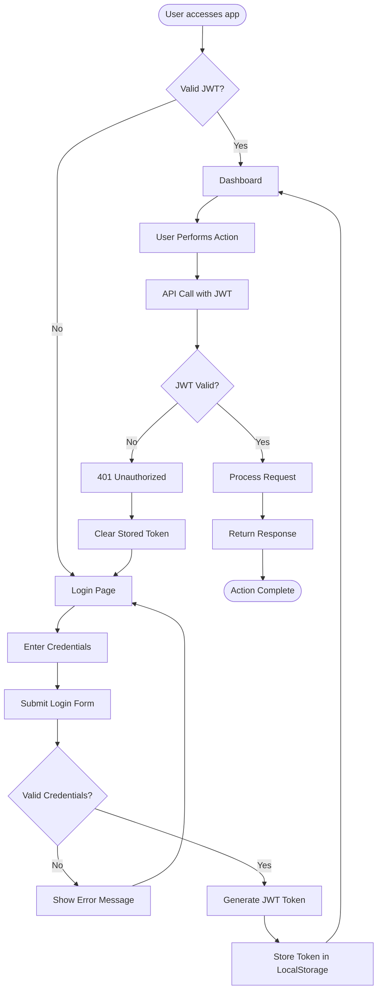
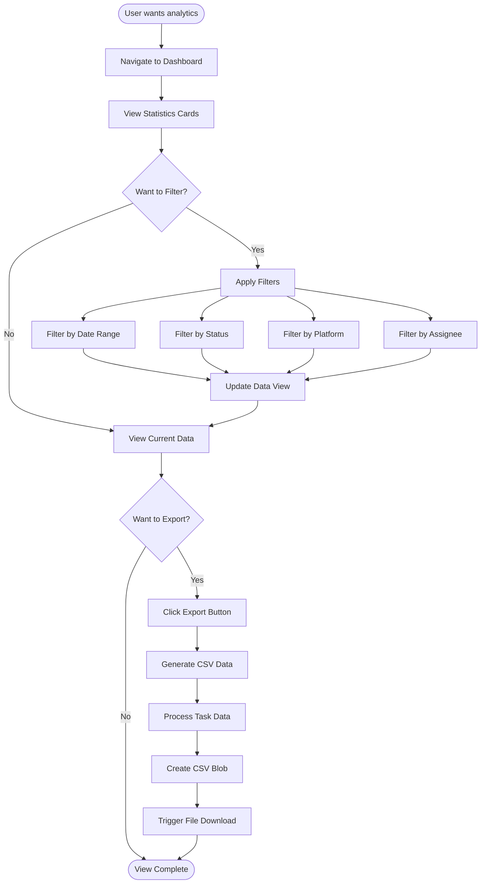
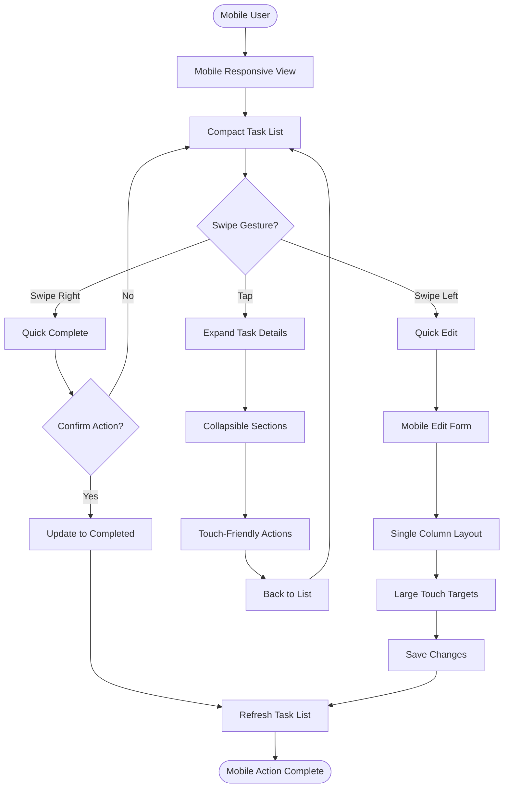
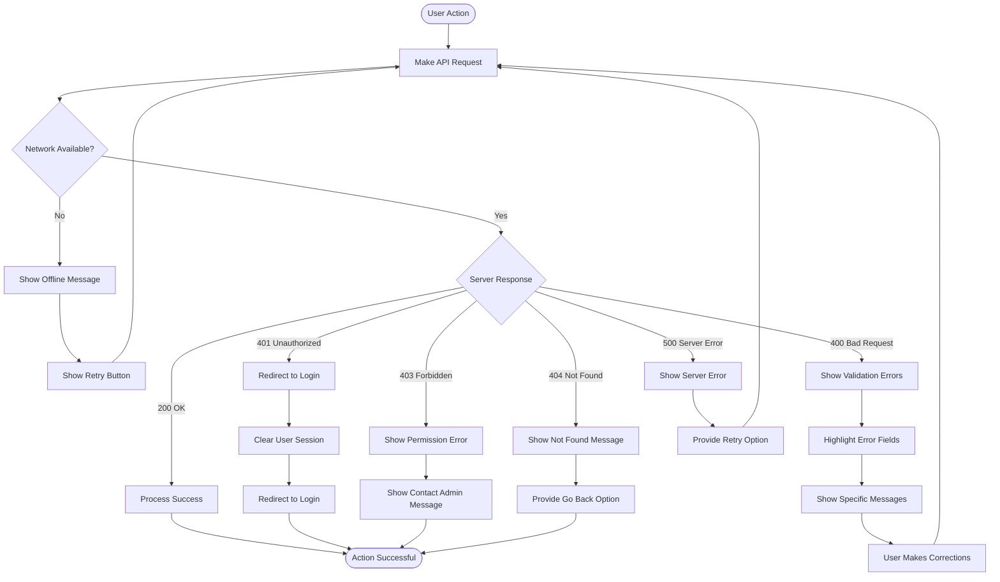

# User Flow Diagrams

## Task Creation Flow

```mermaid
flowchart TD
    Start([User wants to create task]) --> Login{Logged in?}
    Login -->|No| LoginPage[Login Page]
    LoginPage --> Auth[Authenticate]
    Auth --> Dashboard[Dashboard]
    Login -->|Yes| Dashboard
    
    Dashboard --> CreateBtn[Click Create Task]
    CreateBtn --> TaskForm[Task Creation Form]
    
    TaskForm --> FillTitle[Fill Title*]
    FillTitle --> SelectPlatform[Select Platform*]
    SelectPlatform --> SelectFormat[Select Format]
    SelectFormat --> SelectChannel[Select Channel]
    SelectChannel --> OptionalFields[Optional Fields]
    
    OptionalFields --> ScheduleDate[Schedule Date]
    OptionalFields --> AssignUser[Assign User]
    OptionalFields --> AddNotes[Add Notes]
    OptionalFields --> UploadFiles[Upload Files]
    
    ScheduleDate --> Validate{Valid Data?}
    AssignUser --> Validate
    AddNotes --> Validate
    UploadFiles --> Validate
    
    Validate -->|No| ShowErrors[Show Validation Errors]
    ShowErrors --> TaskForm
    
    Validate -->|Yes| SaveTask[Save Task]
    SaveTask --> Success[Success Message]
    Success --> TaskList[Redirect to Task List]
    TaskList --> End([Task Created])
```

## Task Status Update Flow

```mermaid
flowchart TD
    Start([User views task list]) --> TaskList[Task List Display]
    TaskList --> SelectTask[Click on Task]
    
    SelectTask --> CurrentStatus{Current Status}
    
    CurrentStatus -->|Todo| TodoActions[Todo Actions]
    CurrentStatus -->|In Progress| ProgressActions[In Progress Actions]
    CurrentStatus -->|Completed| CompletedActions[Completed Actions]
    
    TodoActions --> StartTask[Click Start Task]
    StartTask --> UpdateToProgress[Status: In Progress]
    
    ProgressActions --> MarkDone[Click Mark Done]
    ProgressActions --> RevertTodo[Click Revert to Todo]
    MarkDone --> UpdateToCompleted[Status: Completed]
    RevertTodo --> UpdateToTodo[Status: Todo]
    
    CompletedActions --> ReopenTask[Click Reopen Task]
    ReopenTask --> UpdateToProgress2[Status: In Progress]
    
    UpdateToProgress --> SaveStatus[Save to Database]
    UpdateToCompleted --> SaveStatus
    UpdateToTodo --> SaveStatus
    UpdateToProgress2 --> SaveStatus
    
    SaveStatus --> Success{Save Success?}
    Success -->|Yes| RefreshUI[Refresh UI]
    Success -->|No| ErrorMsg[Show Error Message]
    
    RefreshUI --> End([Status Updated])
    ErrorMsg --> TaskList
```

## User Authentication Flow

```mermaid
flowchart TD
    Start([User accesses app]) --> CheckToken{Valid JWT?}
    
    CheckToken -->|Yes| Dashboard[Dashboard]
    CheckToken -->|No| LoginPage[Login Page]
    
    LoginPage --> EnterCreds[Enter Credentials]
    EnterCreds --> SubmitLogin[Submit Login Form]
    
    SubmitLogin --> ValidateCreds{Valid Credentials?}
    ValidateCreds -->|No| LoginError[Show Error Message]
    LoginError --> LoginPage
    
    ValidateCreds -->|Yes| GenerateJWT[Generate JWT Token]
    GenerateJWT --> StoreToken[Store Token in LocalStorage]
    StoreToken --> Dashboard
    
    Dashboard --> UserAction[User Performs Action]
    UserAction --> APICall[API Call with JWT]
    
    APICall --> VerifyJWT{JWT Valid?}
    VerifyJWT -->|Yes| ProcessRequest[Process Request]
    VerifyJWT -->|No| Unauthorized[401 Unauthorized]
    
    ProcessRequest --> Response[Return Response]
    Response --> End([Action Complete])
    
    Unauthorized --> ClearToken[Clear Stored Token]
    ClearToken --> LoginPage
```

## Analytics & Export Flow

```mermaid
flowchart TD
    Start([User wants analytics]) --> Dashboard[Navigate to Dashboard]
    Dashboard --> ViewStats[View Statistics Cards]
    
    ViewStats --> FilterOptions{Want to Filter?}
    FilterOptions -->|Yes| ApplyFilters[Apply Filters]
    FilterOptions -->|No| ViewData[View Current Data]
    
    ApplyFilters --> FilterByDate[Filter by Date Range]
    ApplyFilters --> FilterByStatus[Filter by Status]
    ApplyFilters --> FilterByPlatform[Filter by Platform]
    ApplyFilters --> FilterByUser[Filter by Assignee]
    
    FilterByDate --> UpdateView[Update Data View]
    FilterByStatus --> UpdateView
    FilterByPlatform --> UpdateView
    FilterByUser --> UpdateView
    
    UpdateView --> ViewData
    ViewData --> ExportOption{Want to Export?}
    
    ExportOption -->|No| End([View Complete])
    ExportOption -->|Yes| ClickExport[Click Export Button]
    
    ClickExport --> GenerateCSV[Generate CSV Data]
    GenerateCSV --> ProcessData[Process Task Data]
    ProcessData --> CreateBlob[Create CSV Blob]
    CreateBlob --> TriggerDownload[Trigger File Download]
    TriggerDownload --> End
```

## Mobile Task Management Flow

```mermaid
flowchart TD
    Start([Mobile User]) --> MobileView[Mobile Responsive View]
    MobileView --> CompactList[Compact Task List]
    
    CompactList --> SwipeGesture{Swipe Gesture?}
    SwipeGesture -->|Swipe Right| QuickComplete[Quick Complete]
    SwipeGesture -->|Swipe Left| QuickEdit[Quick Edit]
    SwipeGesture -->|Tap| TaskDetails[Expand Task Details]
    
    QuickComplete --> ConfirmComplete{Confirm Action?}
    ConfirmComplete -->|Yes| UpdateStatus[Update to Completed]
    ConfirmComplete -->|No| CompactList
    
    QuickEdit --> EditForm[Mobile Edit Form]
    EditForm --> SingleColumn[Single Column Layout]
    SingleColumn --> LargeInputs[Large Touch Targets]
    LargeInputs --> SaveChanges[Save Changes]
    
    TaskDetails --> CollapsibleSections[Collapsible Sections]
    CollapsibleSections --> TouchActions[Touch-Friendly Actions]
    TouchActions --> BackToList[Back to List]
    
    UpdateStatus --> RefreshList[Refresh Task List]
    SaveChanges --> RefreshList
    BackToList --> CompactList
    RefreshList --> End([Mobile Action Complete])
```

## Error Handling Flow

```mermaid
flowchart TD
    Start([User Action]) --> APIRequest[Make API Request]
    APIRequest --> NetworkCheck{Network Available?}
    
    NetworkCheck -->|No| OfflineMode[Show Offline Message]
    OfflineMode --> RetryButton[Show Retry Button]
    RetryButton --> APIRequest
    
    NetworkCheck -->|Yes| ServerResponse{Server Response}
    
    ServerResponse -->|200 OK| Success[Process Success]
    ServerResponse -->|400 Bad Request| ValidationError[Show Validation Errors]
    ServerResponse -->|401 Unauthorized| AuthError[Redirect to Login]
    ServerResponse -->|403 Forbidden| PermissionError[Show Permission Error]
    ServerResponse -->|404 Not Found| NotFoundError[Show Not Found Message]
    ServerResponse -->|500 Server Error| ServerError[Show Server Error]
    
    ValidationError --> HighlightFields[Highlight Error Fields]
    HighlightFields --> ShowMessages[Show Specific Messages]
    ShowMessages --> UserCorrection[User Makes Corrections]
    UserCorrection --> APIRequest
    
    AuthError --> ClearSession[Clear User Session]
    ClearSession --> LoginRedirect[Redirect to Login]
    
    PermissionError --> ContactAdmin[Show Contact Admin Message]
    NotFoundError --> GoBack[Provide Go Back Option]
    ServerError --> RetryOption[Provide Retry Option]
    
    Success --> End([Action Successful])
    LoginRedirect --> End
    ContactAdmin --> End
    GoBack --> End
    RetryOption --> APIRequest
```