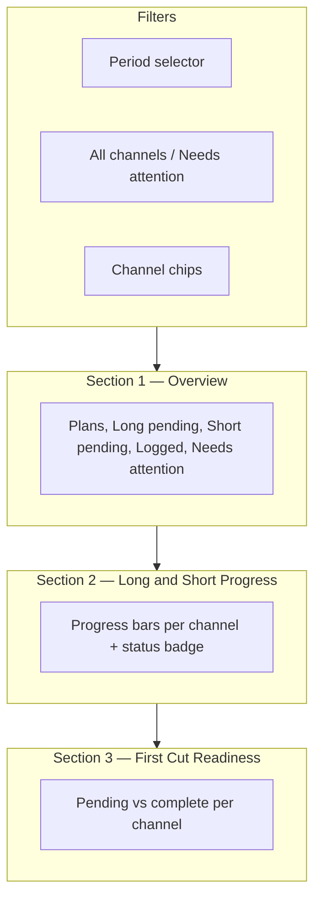

# Channel Planner Report

## Purpose

The **Report** tab under Channel Planner (`/admin/channel-planner`) helps content managers track whether planned video output is on schedule. It compares **plan completion progress** and **work-log coverage** per channel for open plans scheduled in a selected period.

Three tabs on the page: **Plans**, **Log Work**, **Report**.

---

## Layout



---

## Filters

### Period

| Label | Key | Range |
|-------|-----|-------|
| This week | `current-week` | Monday–Sunday of current week |
| **Last Three Month** (default) | `last-3-months` | 1st of (current month − 2) through today |
| This month | `current-month` | 1st through last day of current month |
| Last 12 months | `last-12-months` | 1st of (current month − 11) through today |
| Custom | `custom` | User-selected from/to dates |

### Needs attention

| Value | Behavior |
|-------|----------|
| All channels | Show every channel with data |
| Needs attention | Hide channels where long and short are both on track |

### Channel

All + per-channel chips. Scopes overview totals and progress rows to one channel when selected.

---

## Section 1 — Overview

Compact KPI strip at the top:

| KPI | Source | Meaning |
|-----|--------|---------|
| Plans in period | `totals.planCount` | Open plans scheduled in the period |
| Long pending | `totals.actual.long` | Long videos still to produce |
| Short pending | `totals.actual.short` | Short videos still to produce |
| Logged output | `totals.logged.long + totals.logged.short` | Work logged in the period |
| Needs attention | Count of channels behind | Channels where logged < pending |

---

## Section 2 — Long and Short Progress

Per channel, for plans **scheduled in the period**:

| Metric | Definition |
|--------|------------|
| **Planned** | Sum of `longPlanned` / `shortPlanned` on open period plans |
| **Completed** | Sum of `longCompleted` / `shortCompleted` |
| **Progress %** | `logged / planned` (shown as progress bar — work log output, not task completion) |
| **Pending** | `planned − completed` (still to produce) |
| **Logged** | Latest work log per plan in period, summed by channel |

### Status rules

| Status | Condition |
|--------|-----------|
| **Behind** | `logged < pending` and `pending > 0` for long or short |
| **On track** | `logged >= pending` or `pending === 0` for both formats |

Default sort: **behind channels first**, then alphabetical.

---

## Section 3 — First Cut Readiness

Separate from output metrics. Shows **pending vs complete** first-cut flags for all **open plans** (not limited to report period).

Hidden when all first-cut counts are zero.

First cut is **optional** for plan completion — it does not block marking a plan complete.

---

## API

**Endpoint:** `GET /api/channel-plan-work-logs/summary?from=YYYY-MM-DD&to=YYYY-MM-DD`

**Response:**

```json
{
  "range": { "from": "...", "to": "..." },
  "channels": [
    {
      "channelId": "...",
      "channelName": "...",
      "planCount": 0,
      "planned": { "long": 0, "short": 0 },
      "completed": { "long": 0, "short": 0 },
      "actual": { "long": 0, "short": 0 },
      "logged": { "long": 0, "short": 0 },
      "firstCut": { "pending": 0, "complete": 0 }
    }
  ],
  "totals": { "...same shape..." }
}
```

| Field | Meaning |
|-------|---------|
| `planned` / `completed` | Totals from period plans for progress % |
| `actual` | Pending (`planned − completed`) |
| `logged` | Work-log output in period |
| `firstCut` | All open plans in scope |

---

## Plan completion (cross-reference)

A plan **cannot be completed** while planned longs or shorts remain unlogged. Enforced client-side and server-side (`validatePlanCompletion` in `channelPlanController.js`).

---

## Responsive behavior

| Breakpoint | Layout |
|------------|--------|
| Mobile (< 640px) | Overview KPI 2×2 grid; progress as stacked cards with full-width bars; first cut as compact list |
| Desktop (≥ 640px) | Overview inline KPIs; progress and first cut as tables |

Filter rows scroll horizontally inside their containers.

---

## External report template

Copy and fill for stakeholder reports:

```markdown
# Channel Planner Report — [Period label]
**Range:** [from] – [to]

## Overview
| Plans | Long pending | Short pending | Logged | Needs attention |
|-------|-------------|---------------|--------|-----------------|
| | | | | |

## Long & Short Progress
| Channel | Long progress | Short progress | Status |
|---------|--------------|----------------|--------|
| | % · Pending / Logged | % · Pending / Logged | Behind / On track |

## First Cut Readiness
| Channel | Pending | Complete |
|---------|---------|----------|
| | | |

## Notes
-
```

---

## Implementation files

| File | Role |
|------|------|
| `client/src/pages/admin/ChannelPlanner.jsx` | Report UI (`WorkLogReportPanel`, section components) |
| `server/controllers/channelPlanWorkLogController.js` | `getSummary` API |
| `server/controllers/channelPlanController.js` | Plan completion validation |
