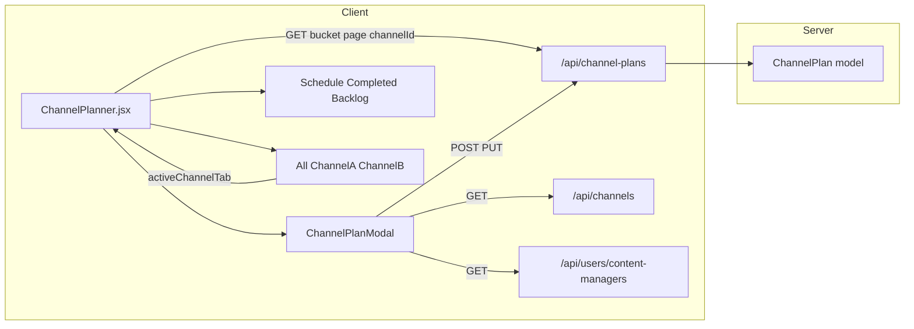
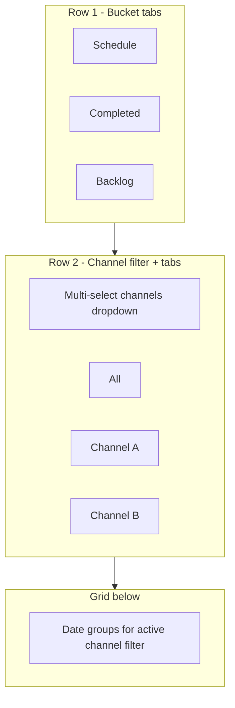
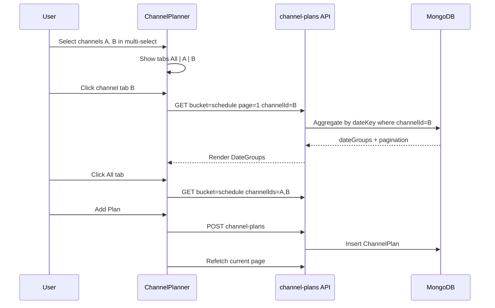

# Channel Planner — independent page plan

## Goal

Add **[Channel Planner](client/src/pages/admin/ChannelPlanner.jsx)** at `/admin/channel-planner`: same overall UX as [Production Hub](client/src/pages/admin/ProductionHub.jsx) (tabs, date groups, Buffer-themed UI) but **fully separate data** and a **new Add Plan** modal. No edits to `ProductionHub.jsx` or its inline `ContentModal`.



---

## Page naming and navigation

| Item          | Value                                                      |
| ------------- | ---------------------------------------------------------- |
| Sidebar label | **Channel Planner**                                        |
| Route         | `/admin/channel-planner`                                   |
| Access        | `admin` only (same as Production Hub)                      |
| Primary CTA   | **Add Plan** (copied UX from “Add Content”, new component) |

Register in [App.jsx](client/src/App.jsx) and [AdminLayout.jsx](client/src/layout/AdminLayout.jsx) sidebar (icon suggestion: `Calendar` or `Layers` from lucide).

---

## New backend: `ChannelPlan` (independent of `VideoTask`)

### Model — [server/models/ChannelPlan.js](server/models/ChannelPlan.js) (new)

| Field                             | Type                   | Notes                                                                 |
| --------------------------------- | ---------------------- | --------------------------------------------------------------------- |
| `title`                           | String                 | Required                                                              |
| `channelId`                       | ObjectId ref `Channel` | From Prompt Library `[GET /channels](server/routes/channelRoutes.js)` |
| `thumbnail`                       | String                 | Base64 data URL or stored path; max **25 KB** enforced server-side    |
| `scheduledDate`                   | Date                   | `null` = backlog                                                      |
| `longPlanned`                     | Number                 | **Separate field** — long-form videos planned; min 0, default 0     |
| `longCompleted`                   | Number                 | **Separate field** — long-form videos completed; min 0, default 0     |
| `shortPlanned`                    | Number                 | **Separate field** — short-form videos planned; min 0, default 0      |
| `shortCompleted`                  | Number                 | **Separate field** — short-form videos completed; min 0, default 0  |
| `notes`                           | String                 | Shown as capsule in grid                                              |
| `assignedTo`                      | ObjectId ref `User`    | Content Manager user                                                  |
| `status`                          | enum                   | `todo`, `in_progress`, `completed` (same semantics as Production Hub) |
| `completedAt`                     | Date                   | Set when marked completed                                             |
| `createdBy`                       | ObjectId ref `User`    |                                                                       |

Indexes: `{ status, scheduledDate }`, `{ status, completedAt }`, `{ channelId }`.

**Video count fields (important):** Long and short each have **two independent inputs** — planned vs completed are **not** a single combined value, ratio, or derived field. All four are stored, validated, and edited separately:

| Field | Meaning | Example input |
|-------|---------|---------------|
| `longPlanned` | How many long videos are planned | `3` |
| `longCompleted` | How many long videos are completed | `1` |
| `shortPlanned` | How many short videos are planned | `5` |
| `shortCompleted` | How many short videos are completed | `2` |

API create/update must accept and return all four keys explicitly. No auto-calculation between planned and completed.

### API — [server/routes/channelPlanRoutes.js](server/routes/channelPlanRoutes.js) (new)

Mount at `/api/channel-plans` in [app.js](server/app.js).

| Method | Endpoint                              | Behavior                                                                                                                                                  |
| ------ | ------------------------------------- | --------------------------------------------------------------------------------------------------------------------------------------------------------- |
| GET    | `/channel-plans/stats`                | Tab counts (schedule / backlog / completed); optional `channelId` or `channelIds` filter |
| GET    | `/channel-plans?bucket=&page=&limit=&channelId=&channelIds=` | Paginated **date groups**; filter by single `channelId` or comma-separated `channelIds` (for **All** tab over selected channels) |
| POST   | `/channel-plans`                      | Create plan                                                                                                                                               |
| PUT    | `/channel-plans/:id`                  | Update plan                                                                                                                                               |
| DELETE | `/channel-plans/:id`                  | Delete plan                                                                                                                                               |

**Bucket rules** (mirror Production Hub):

- `schedule`: `scheduledDate` set, `status !== completed`
- `backlog`: `scheduledDate` null, `status !== completed`
- `completed`: `status === completed`

### Thumbnail upload

- New [server/middleware/thumbnailUpload.js](server/middleware/thumbnailUpload.js): `multer.memoryStorage()`, **25 KB** limit, image MIME filter (`image/jpeg`, `image/png`, `image/webp`).
- Validate on POST/PUT; store as `data:image/...;base64,...` in `thumbnail` field (simple, no GridFS for 25 KB cap).

### Content Manager users endpoint

Add **read-only** route for assignee dropdown (admin-only):

`GET /api/users/content-managers` → `User.find({ companyId, role: "content_manager", active: true }).select("name email")`

Implement in [userController.js](server/controllers/userController.js) + [userRoutes.js](server/routes/userRoutes.js). Does not change existing `GET /users` behavior.

### Channel frequency (frequently used on top)

**Client-side** (no DB change): on save/select, bump `channelId` in `localStorage` key `channelPlanner_recentChannels`. Dropdown sorts: frequent (top 5–8) → divider → alphabetical rest. Channels loaded from existing `GET /api/channels` (same as [PromptManager.jsx](client/src/components/PromptManager.jsx)).

---

## Frontend: new page (copy Production Hub, then specialize)

### Main file — [client/src/pages/admin/ChannelPlanner.jsx](client/src/pages/admin/ChannelPlanner.jsx) (new)

**Copy starting point:** structure from `ProductionHub.jsx` (~lines 2207+ for page shell, filter bar, tabs, date groups, pagination).

**Keep (adapted):**

- `AdminLayout` wrapper, `contentFit`
- `viewMode`: `schedule` | `completed` | `backlog` (primary tab row — same `FilterSegment` style as Production Hub)
- `FilterBar` / search (search title, notes)
- `DateGroup` pattern: collapsible date header, task count badges
- Server-side pagination (`DATE_GROUP_PAGE_SIZE = 10`) calling `/channel-plans`
- Buffer theme classes per [.cursor/rules/buffer-ui-theme.mdc](.cursor/rules/buffer-ui-theme.mdc)

### Multi-channel tabs (new requirement)

Two-level navigation on the page:



**Channel multi-select (toolbar):**
- Multi-select control populated from `GET /api/channels` (Prompt Library channels)
- User can pick one or more channels; selection persisted in `localStorage` (`channelPlanner_selectedChannels`)
- Frequently used channels still pinned at top of the picker (same `channelPlanner_recentChannels` logic)

**Channel tab row (secondary, below bucket tabs):**
- Always show an **All** tab first
- When user selects channels in the multi-select, render additional tabs — one per channel name (same pill/toggle style as Schedule / Completed / Backlog)
- `activeChannelTab`: `"all"` | `channelId` (string)
- **All tab:** fetch with `channelIds=A,B,C` when channels are selected; if **no channels selected**, fetch with no channel filter (entire company dataset)
- **Single channel tab:** fetch with `channelId=<id>`; grid shows only that channel’s plans for the current bucket
- Switching channel tab resets date-group pagination to page 1 and refetches
- Tab counts on bucket row can optionally reflect active channel filter (stats endpoint accepts same `channelId` / `channelIds` params)

**State summary:**

| State | Purpose |
|-------|---------|
| `viewMode` | `schedule` \| `completed` \| `backlog` |
| `selectedChannelIds` | Multi-select filter (array of channel ObjectIds) |
| `activeChannelTab` | `"all"` or one `channelId` from selected set |
| `dateGroupPage` | Pagination within current bucket + channel filter |

**Remove from copy (not needed for Channel Planner):**

- Analyze / Preview / Manage taxonomies / voice-over / drag-drop status / platform icons / CSV export / planner categories modals
- All `video-tasks` API calls

### New row component — `ChannelPlanRow` (inline in same file)

Production Hub `TaskRow` is the visual reference; simplified columns:

| Column              | UI                                                                                                                        |
| ------------------- | ------------------------------------------------------------------------------------------------------------------------- |
| Thumbnail           | Small preview (`w-10 h-6`); click opens `ThumbnailModal` (reuse pattern from Production Hub ~line 186) showing full image |
| Long counts         | Two separate readouts: **Long planned** and **Long completed** (e.g. pills `L plan 3` · `L done 1`) — not a single merged field |
| Short counts        | Two separate readouts: **Short planned** and **Short completed** (e.g. `S plan 5` · `S done 2`)                                |
| Title               | `truncateTaskTitle` helper (copy 60-char util) + `title` tooltip                                                          |
| Notes               | Capsule pill (`rounded-full`, muted bg, truncate); click opens read/edit or tooltip for full text                         |
| Actions             | Edit / Delete icons (same hover pattern as TaskRow)                                                                       |

### Date group header

Same grid alignment style as Production Hub `DateGroup` but summary shows aggregate long/short planned vs completed for that date (optional small badges).

---

## Add Plan modal — `ChannelPlanModal` (new, copied from `ContentModal`)

Copy [ContentModal](client/src/pages/admin/ProductionHub.jsx) (~1802–2204) into **new component** (either inline in `ChannelPlanner.jsx` or `client/src/components/ChannelPlanModal.jsx`).

### Form fields (new)

| Field            | Control                                                                         |
| ---------------- | ------------------------------------------------------------------------------- |
| **Channel**      | `<select>` from `/channels`; frequent channels pinned at top                    |
| **Thumbnail**    | File input, client validates ≤25 KB before upload; preview chip                 |
| **Date**         | Date input + “Add to Backlog” toggle (same UX as Production Hub backlog toggle) |
| **Title**        | Text input (required)                                                           |
| **Notes**        | Textarea                                                                        |
| **Assigned to**  | Single-select dropdown from `/users/content-managers` (show `name`)             |

### Video count inputs — four separate fields

Use **four distinct number inputs** (not one combined control). Group visually under Long / Short sections:

| UI label | `name` / payload key | Input type |
|----------|----------------------|------------|
| Long videos — Planned | `longPlanned` | `number`, min 0 |
| Long videos — Completed | `longCompleted` | `number`, min 0 |
| Short videos — Planned | `shortPlanned` | `number`, min 0 |
| Short videos — Completed | `shortCompleted` | `number`, min 0 |

Layout suggestion (Buffer form): two rows, each with a “Planned” and “Completed” column:

```
Long videos    [ Planned: __ ]  [ Completed: __ ]
Short videos   [ Planned: __ ]  [ Completed: __ ]
```

Each field is optional (defaults to `0`); user can set planned without completed, or vice versa.

### Removed (per requirement)

- URL, Content Format pills, platform row (YT/FB/Insta/Website), Channel Type, Script, Voice-over

### Save payload

`POST/PUT /channel-plans` example:

```json
{
  "title": "...",
  "channelId": "...",
  "scheduledDate": "2026-07-11",
  "longPlanned": 3,
  "longCompleted": 1,
  "shortPlanned": 5,
  "shortCompleted": 2,
  "notes": "...",
  "assignedTo": "..."
}
```

`scheduledDate: null` when backlog toggle is on.

---

## Data flow



---

## Files to create / modify

| Action            | File                                                                                 |
| ----------------- | ------------------------------------------------------------------------------------ |
| **Create**        | `server/models/ChannelPlan.js`                                                       |
| **Create**        | `server/controllers/channelPlanController.js`                                        |
| **Create**        | `server/routes/channelPlanRoutes.js`                                                 |
| **Create**        | `server/middleware/thumbnailUpload.js`                                               |
| **Create**        | `client/src/pages/admin/ChannelPlanner.jsx`                                          |
| **Create**        | `client/src/components/ChannelPlanModal.jsx` (optional split)                        |
| **Modify**        | `server/app.js` — mount `/api/channel-plans`                                         |
| **Modify**        | `server/controllers/userController.js` + `userRoutes.js` — content-managers endpoint |
| **Modify**        | `client/src/App.jsx` — route                                                         |
| **Modify**        | `client/src/layout/AdminLayout.jsx` — sidebar item                                   |
| **Do NOT modify** | `ProductionHub.jsx`, `ContentModal`, `VideoTask` model, `/video-tasks` routes        |

---

## Verification

1. `npm run build` in `client/`
2. Manual smoke (no automated browser unless you ask later):
  - Channel Planner appears in sidebar; Production Hub unchanged
  - Add Plan: channel dropdown with frequent ordering, 25 KB thumbnail reject/accept, content managers in Assigned to
  - Schedule / Completed / Backlog tabs filter correctly
  - Multi-channel select creates **All** + per-channel tabs; switching tabs loads correct filtered grid
  - **All** tab with 2+ channels selected shows combined plans; with none selected shows all channels
  - Date groups paginate 10 per API page
  - Row: thumbnail modal, count pills, title truncate, notes capsule
  - Edit / delete round-trip

---

## Implementation order

1. Backend model + CRUD + paginated GET + thumbnail validation
2. Content-managers user endpoint
3. ChannelPlanner page shell (bucket tabs, channel multi-select + channel tab row, fetch, pagination)
4. ChannelPlanModal (form + save)
5. ChannelPlanRow + DateGroup + ThumbnailModal
6. Route + sidebar + build check
